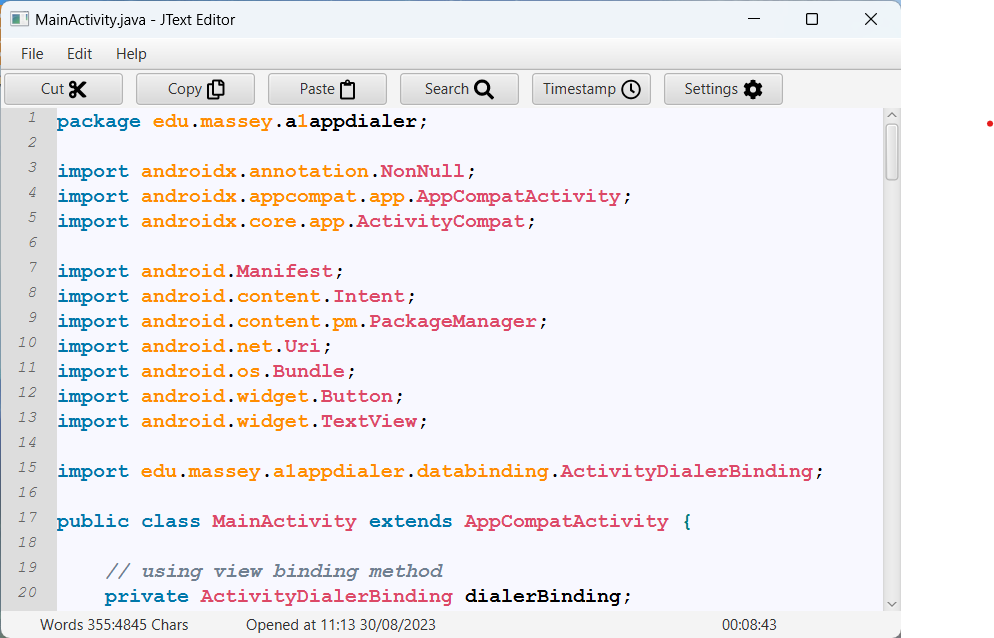

# Assignment 1 - 159251 (JTextEditor) 

Lightweight code and text editor, complete with syntax highlighting (limited functionality), file conversions, cut/copy/paste functionality, and more. Created using:
- Java as the programming language.
- JUnit/TestFx for unit testing.
- Github Actions for CI/CD.
- Java FX for creating the GUI application.
- JetBrains IntelliJ IDEA as the IDE.

Note: This was a group assignment with the following members:
- Saad Billah (21011762)
- Rob Simpson (20021344)

---

### Massey University Disclaimer

This is a submission for a group assignment for the Massey University course 159.251 - Software Eng Design and Construction. Under no circumstances is it to be copied and submitted anywhere as plagiarised work.

---

### Installation Instructions:
1. Create a new directory and use `git clone` to clone https://github.com/mmbi-glitch/251-Assignment1-2022-Rob-Saad
2. From this directory use `mvn compile` to compile the editor in this folder
3. If you package/test/verify locally do not move the mouse during the FXRobot Testing, enjoy the show!
4. Double click on JTextEditor.JAR to run the application

---

### Features:
- Open .txt, .odt and extract text from PDF documents
- Save as .txt, .odt and PDF (including conversion from one to the other)
- Select Cut Copy Paste and Add Timestamps
- Print to system printer
- Syntax Highlighting for Java and CPP
- YaML Configuration file holds custom username, and saves font size preferences

---

### Screenshots

The text editor in action:

 
Syntax highlighting for java files:

 
Opening PDF files (does file conversion):
 

---

### Commit IDs:
#### Saad: 
- 45b873d064aa81fbd9c06f63f973bbe9867b1118 (PDF_conversion)
- 45b873d064aa81fbd9c06f63f973bbe9867b1118 (Printing)
#### Rob: 
- 45b873d064aa81fbd9c06f63f973bbe9867b1118 (Addition of Status Bar)
- 45b873d064aa81fbd9c06f63f973bbe9867b1118 (First round of tests built)
